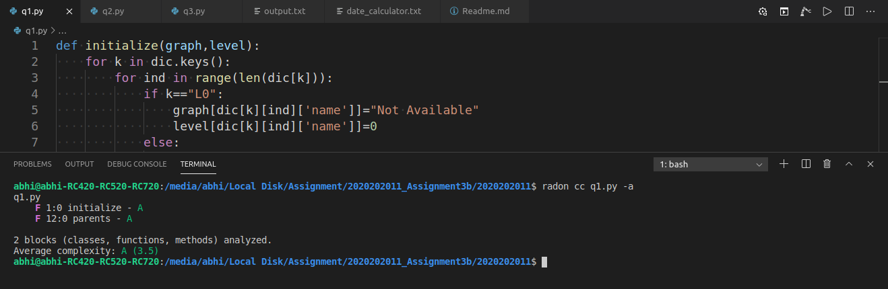
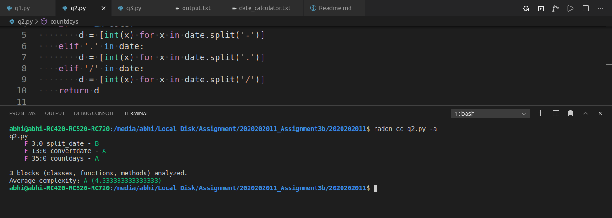
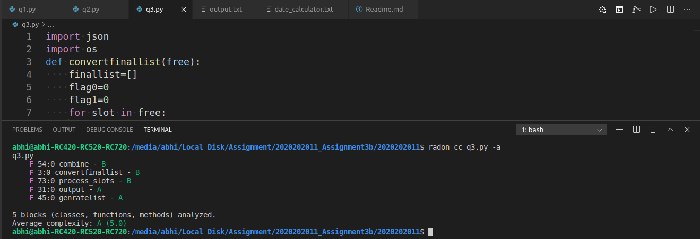

# SSD Assignment 3C

Github Repo Link - [https://github.com/abhijeet181995/SSD-Assignmnet-3a/tree/PartC]

Commit File Change for Detailed File Difference [https://github.com/abhijeet181995/SSD-Assignmnet-3a/pull/1/files]

## Question 1

- Name is assumed to be the employee id (001-999)
- Employee Ids are to be separted with spaces

## Radon Output 1

## Line Changes Question 1

- Line 1-10 Added a new function intialize the used to intialize graph and level dictionary.

## Question 2

- The data format should be given as mentioned in the assignment
- date_calculator.txt should be present in the same directory and should be readable as well.4
- commandline is to provided for dd/mm/yyyy or mm/dd/yyyy else default format of alphanumeric will be used

## Radon Output 2

## Line Changes Question 2

- Line 3-10 added new function split_date.

## Question 3

- Make sure Employee1.txt Employee2.txt are present in the [Employee] folder in the same directory.
- Name of the Employee file and Employee name should be same.
- Dates should be same otherwise individual slot are given but no common slot printed.
- The format provided in the assignment should be same as described in the assignment

## Radon Output 3

## Line Changes Question 3

- No changes.
